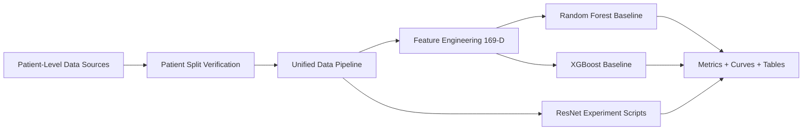

# Li Shuo Research Project: Esophageal Pacing ECG Analysis for SVT Classification

[中文版本 / Chinese Version](README.md)

[](#2-scope-of-this-public-repository)
[](#1-scientific-context)
[](#7-recommended-execution-order)
[](#6-installation)
[](#9-data-governance-and-privacy)

A reproducible machine-learning and deep-learning codebase for multi-lead ECG analysis in the context of **esophageal pacing** and supraventricular tachycardia (SVT) phenotype classification.

## 1. Scientific Context
This repository supports a clinical research workflow focused on arrhythmia discrimination from esophageal pacing-related ECG recordings.

### Clinical and Methodological Targets
- Patient-level split verification to prevent train-test leakage
- Feature-engineered machine-learning baselines (Random Forest, XGBoost)
- Deep-learning experiment scripts (ResNet-based and legacy pipelines)
- Manuscript-facing figure and table regeneration utilities

### Classification Tasks
- **3-class task**: AVNRT / AVRT / N
- **4-class task**: AVNRT / AVRT-L / AVRT-R / N

## 2. Scope of This Public Repository
This repository is intentionally **code-first** and **privacy-preserving**.

Included:
- Source code and reproducible scripts
- Lightweight technical documentation

Excluded:
- Raw ECG datasets
- Patient-identifiable artifacts
- Generated local result files

This design follows data minimization and publication-readiness principles.

## 3. Repository Layout
```text
.
|-- scripts/
|   |-- data_pipeline.py
|   |-- feature_engineering.py
|   |-- verify_patient_split.py
|   |-- train_rf.py
|   |-- train_xgboost.py
|   |-- paths.py
|   `-- requirements.txt
|-- 源代码/
|   `-- *.py (legacy deep-learning source)
|-- 深度学习模型图片修复/
|   `-- resnet_experiment/
|       `-- *.py (retraining + figure/table regeneration)
|-- doc/
|   `-- REPO_STRUCTURE.md
|-- .gitignore
|-- README.md
`-- README_EN.md
```

## 4. End-to-End Pipeline


## 5. Methodological Highlights
### A. Patient-level split audit
`verify_patient_split.py` validates train/test isolation at patient level.

### B. Feature engineering
`feature_engineering.py` extracts **169 features per ECG segment**:
- Time-domain: 10 features x 13 leads
- Frequency-domain: 3 features x 13 leads

### C. Baseline models
- `train_rf.py`: Random Forest with grid search + stratified CV
- `train_xgboost.py`: XGBoost with grid search + stratified CV + feature importance

### D. Deep-learning support
- Legacy scripts under `源代码/`
- ResNet retraining and figure/table scripts under `深度学习模型图片修复/resnet_experiment/`

## 6. Installation
```bash
python -m venv .venv
# Windows PowerShell
.\.venv\Scripts\Activate.ps1
pip install -r scripts/requirements.txt
```

## 7. Recommended Execution Order
Run from project root:
```bash
python scripts/verify_patient_split.py
python scripts/feature_engineering.py
python scripts/train_rf.py --fast
python scripts/train_xgboost.py --fast
```

For full hyperparameter search, remove `--fast`.

## 8. Reproducibility Checklist
- Fixed random seeds in baseline training (`random_state=42`)
- Stratified cross-validation for model selection
- Centralized path management in `scripts/paths.py`
- Deterministic workflow order for reporting

## 9. Data Governance and Privacy
This repository does **not** publish:
- Raw CSV ECG datasets
- Intermediate files containing patient identifiers
- Generated local result artifacts

Any clinical data use must comply with local IRB/ethics and institutional data-governance policies.

## 10. Publication-Oriented Positioning
This codebase is designed to support:
- Transparent method reporting
- Reviewer-facing baseline comparisons
- Reproducible figure and table regeneration

## 11. Citation
If you use this repository in academic work, please cite the associated manuscript (to be updated upon publication).

## 12. Acknowledgment
Project lead: **Dr. Li Shuo**

## 13. Contact
For technical questions, please open a GitHub issue.
