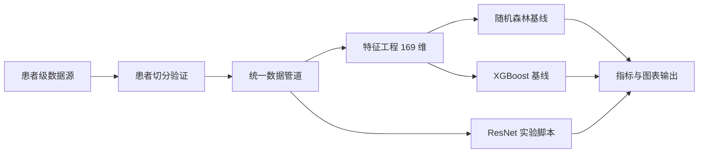

# 李烁博士研究课题：食道调搏心电信号的 SVT 分型研究

[English Version](README.md)

[](#2-公开仓库范围)
[](#1-研究背景)
[](#7-推荐执行顺序)
[](#6-环境安装)
[](#9-数据治理与隐私声明)

本仓库用于复现与展示：基于**食道调搏（Esophageal Pacing）**场景下的多导联心电（ECG）分析流程，覆盖特征工程机器学习基线与深度学习实验脚本，服务于室上性心动过速（SVT）相关分型研究。

## 1. 研究背景
该项目围绕临床心电研究流程，目标是提升食道调搏相关 ECG 数据在心律失常分型任务中的可解释性与可复现性。

### 临床与方法目标
- 进行患者级训练/测试隔离验证，避免数据泄漏
- 构建特征工程 ML 基线（Random Forest、XGBoost）
- 提供深度学习实验与图表重绘脚本（ResNet 相关）
- 支持论文与审稿回复场景下的方法学复现

### 分类任务
- **3 分类**：AVNRT / AVRT / N
- **4 分类**：AVNRT / AVRT-L / AVRT-R / N

## 2. 公开仓库范围
本公开仓库采用“**代码优先 + 隐私优先**”策略。

包含：
- 方法代码与复现实验脚本
- 轻量级项目文档

不包含：
- 原始 ECG 数据
- 患者可识别信息相关中间文件
- 本地产生的结果文件（图、表、缓存等）

## 3. 仓库结构
```text
.
|-- scripts/
|   |-- data_pipeline.py
|   |-- feature_engineering.py
|   |-- verify_patient_split.py
|   |-- train_rf.py
|   |-- train_xgboost.py
|   |-- paths.py
|   `-- requirements.txt
|-- 源代码/
|   `-- *.py (历史深度学习代码)
|-- 深度学习模型图片修复/
|   `-- resnet_experiment/
|       `-- *.py (重训与图表生成脚本)
|-- doc/
|   `-- REPO_STRUCTURE.md
|-- .gitignore
|-- README.md
`-- README_ZH.md
```

## 4. 端到端流程


## 5. 方法学要点
### A. 患者级隔离验证
`verify_patient_split.py` 用于审计训练/测试集合在患者维度上的隔离情况。

### B. 特征工程
`feature_engineering.py` 为每个 ECG 片段提取 **169 维特征**：
- 时域：10 x 13 导联
- 频域：3 x 13 导联

### C. 基线建模
- `train_rf.py`：随机森林 + 网格搜索 + 分层交叉验证
- `train_xgboost.py`：XGBoost + 网格搜索 + 分层交叉验证 + 特征重要性

### D. 深度学习支持
- `源代码/`：历史深度学习脚本
- `深度学习模型图片修复/resnet_experiment/`：ResNet 重训与论文图表脚本

## 6. 环境安装
```bash
python -m venv .venv
# Windows PowerShell
.\.venv\Scripts\Activate.ps1
pip install -r scripts/requirements.txt
```

## 7. 推荐执行顺序
在项目根目录运行：
```bash
python scripts/verify_patient_split.py
python scripts/feature_engineering.py
python scripts/train_rf.py --fast
python scripts/train_xgboost.py --fast
```

如需完整超参数搜索，可去掉 `--fast`。

## 8. 可复现性清单
- 基线训练设置固定随机种子（`random_state=42`）
- 使用分层交叉验证进行模型选择
- 路径集中管理于 `scripts/paths.py`
- 流程顺序可稳定复现

## 9. 数据治理与隐私声明
本仓库不会公开：
- 原始 CSV 心电数据
- 含患者标识信息的中间文件
- 本地生成的结果产物

涉及临床数据使用时，请遵守所属机构伦理审查（IRB）与数据治理规范。

## 10. 论文与审稿支持定位
当前结构可直接支持：
- 方法透明化描述
- 审稿意见回复中的基线对比
- 图表与结论的可复现实验链路

## 11. 引用
若本仓库用于学术研究，请在论文中引用对应成果（论文发表后补充正式引用信息）。

## 12. 致谢
课题负责人：**李烁博士**

## 13. 联系方式
如有技术问题，欢迎通过 GitHub Issue 联系。
